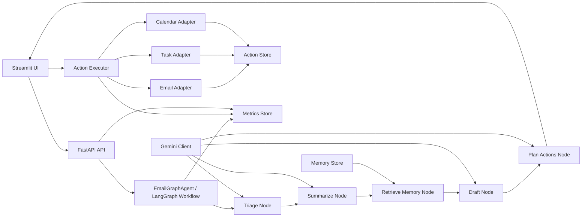

<!-- DOCUMENTATION.md -->

# Documentation

## Description

Prototype AI email assistant that analyzes email threads, generates draft replies, proposes actions, and requires human approval before execution.

The system demonstrates a modular architecture combining LLM reasoning, workflow orchestration, mock tool execution, and observability.

# Features

- Email thread triage and summarization
- Draft reply generation
- Structured action planning
- Human-in-the-loop approval
- Mock execution for email, tasks, and calendar
- Observability metrics and logging
- Interactive Streamlit UI

# Agent Design and Architecture

The agent processes an email thread through a sequence of reasoning steps.

Each step is implemented as a **node in a workflow pipeline**, allowing the system to maintain structured state between reasoning stages.

## Workflow

1. **Triage**
   - Classifies the email
   - Determines priority, category, and whether a reply is required.

2. **Summarization**
   - Extracts key points from the email thread.
   - Identifies the main request.

3. **Memory Retrieval**
   - Retrieves contextual information such as user preferences or contacts.

4. **Draft Generation**
   - Produces a suggested reply using the thread context and retrieved memory.

5. **Action Planning**
   - Generates structured actions such as:
     - `send_email`
     - `create_task`
     - `create_calendar_event`

6. **Human Approval**
   - The user reviews and approves selected actions through the UI.

7. **Execution**
   - Approved actions are executed via mock adapters.

## Architecture Diagram



## System Components

The system is divided into several logical components:

**Agent Core**

Handles the reasoning workflow and orchestrates the different nodes of the pipeline.

**API Layer**

A FastAPI service that exposes endpoints for:

- running the agent
- checking system health
- retrieving observability metrics

**Infrastructure Layer**

Handles integrations and system utilities such as:

- action execution
- memory storage
- metrics collection
- external LLM calls

**User Interface**

A Streamlit application that allows the user to:

- browse email threads
- run the agent
- inspect outputs
- edit proposed actions
- approve execution

UI access:
```bash
http://localhost:8501
```

# Memory Strategy

The agent uses a **lightweight contextual memory store**.

The memory store contains structured information such as:

- known contacts
- user preferences
- organizational context

Memory is retrieved during the reasoning process to improve draft quality and action planning.

After user-approved actions are executed, relevant information may be written back to memory, allowing the system to gradually accumulate context across interactions.

The current implementation uses an **in-memory store** designed for demonstration purposes.  
The architecture allows replacing this with a persistent database or vector store.

# Observability and Monitoring

The system includes basic observability through:

- structured logging
- runtime metrics

Metrics are collected through a central **metrics store** and exposed through an API endpoint:
```bash
GET http://localhost:8000/observability/metrics
```

Metrics include:

- total agent runs
- successful vs failed runs
- node execution metrics
- action execution metrics

The Streamlit UI also displays observability metrics in a dashboard for quick inspection of system behavior.

# Limitations

This repository is a prototype and includes several simplifications:

- external integrations are mocked
- persistence is minimal
- limited error handling
- no authentication layer